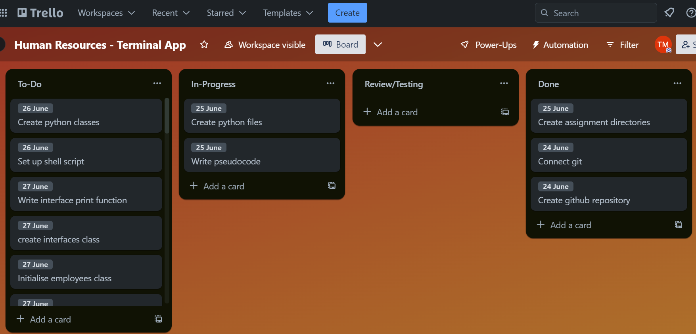
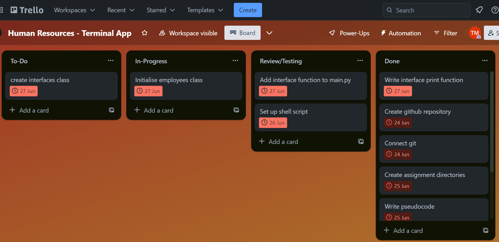
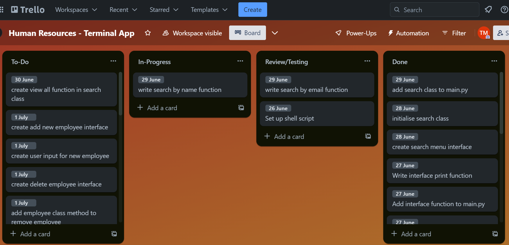
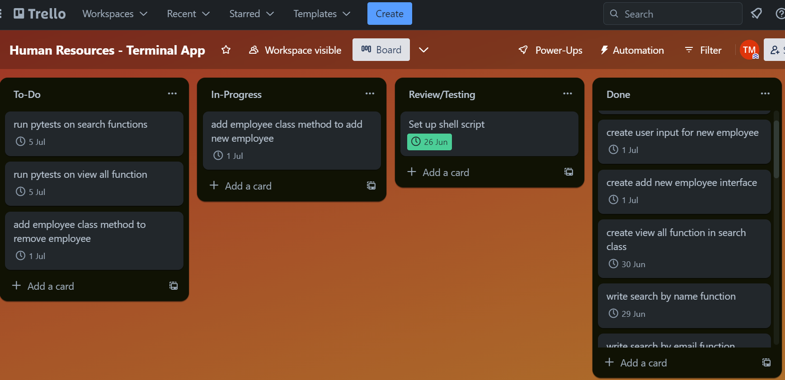
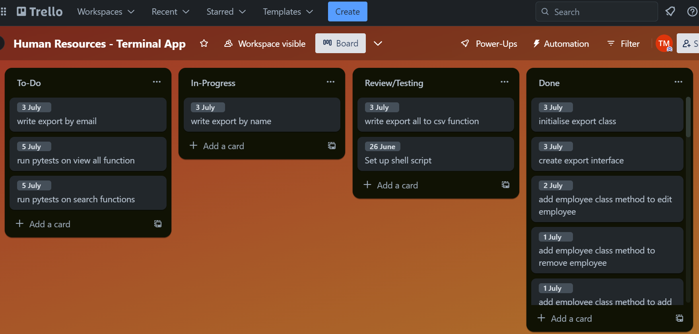

# Human Resources: Terminal Application
### GitHub Repository: [github.com/tmarentes/terminal-app](https://github.com/TMarentes/terminal-app) 
 

## Styling Convention
PEP8 Styling Convention
https://peps.python.org/pep-0008/

 

## Features
### Search by name or email
### View all employees
### Export employees to csv
### Add & delete employees
### Edit existing employee

 

## Implementation Plan
### Initial Steps
In the early stages of developing a terminal application in Python, the first steps are creating a GitHub repository and establishing a connection to Git. This enables version control as the project progresses.

|Task|Deadline|Status|
|----------------|:------:|:----:|
|Create github repository|  24/06/23      |  ✅  | 
|Connect git|  24/06/23      |  ✅  | 
|Create assignment directories|  25/06/23      |  ✅  | 
|Write Pseudocode|  25/06/23      |  ✅  | 
|Create python files|  25/06/23      |  ✅  | 
|Setup shell script|  26/06/23      |  ✅  | 
|Create python classes| 26/06/23       |  ✅  | 

 

### Interface
An interface will be created with an interface class with multi-line print statements as functions.

|Task|Deadline|Status|
|----------------|:------:|:----:|
|create interfaces class|  27/06/23      |  ✅  | 
|write interface print function|  27/06/23      |   ✅ | 
|add interface function to main.py|  28/06/23      |  ✅  | 
|initialise employees class|  28/06/23      |  ✅  | 

 

### Search by name or email
The search functionality will use a Search class with functions that access the Employee class.

|Task|Deadline|Status|
|----------------|:------:|:----:|
|create search menu interface|  28/06/23      |  ✅  | 
|initialise search class|  28/06/23      |  ✅  | 
|write search by name function|  29/06/23      |  ✅  | 
|write search by email function|  29/06/23      |  ✅  | 
|add search class to main.py|  29/06/23      |  ✅  | 
|run pytests on search functions|  05/07/23      |    | 

 

### View all employees
To view all employees, a method in the Search class accesses the entire Employee class.

|Task|Deadline|Status|
|----------------|:------:|:----:|
|create view all function in search class|  30/06/23      |  ✅  | 
|run pytests on view all function| 05/07/23     |  ✅  | 

 

### Add & delete employees
To add and delete employees, methods are used in the Employee class.

|Task|Deadline|Status|
|----------------|:------:|:----:|
|create add new employee interface|  01/07/23      |  ✅  | 
|create delete employee interface| 01/07/23     |  ✅  | 
|create user input for new employee|  01/07/23      |  ✅  | 
|add employee class method to add new employee|  01/07/23      |  ✅  | 
|add employee class method to remove employee|  01/07/23      |  ✅  | 

 

### Edit existing employee
To edit an existing employee, the user first must search for the employee, then will be prompted with inputs for the new information.

|Task|Deadline|Status|
|----------------|:------:|:----:|
|create edit employee interface|  02/07/23      |  ✅  | 
|create user input for new data| 02/07/23     |  ✅  | 
|add employee class method to edit employee|  02/07/23      |  ✅  | 

### Export employees to csv
Employees are exported using the csv module in python.

|Task|Deadline|Status|
|----------------|:------:|:----:|
|create export interface|  03/07/23      |  ✅  | 
|initialise export class| 03/07/23     |  ✅  | 
|write export all to csv function|  03/07/23      |  ✅  | 
|write export by name|  03/07/23      |  ✅  | 
|write export by email|  03/07/23      |  ✅  | 

 

### Design help documentation which includes a set of instructions which accurately describe how to use and install the application.

You must include:
- steps to install the application
- any dependencies required by the application to operate
- any system/hardware requirements
- how to use any command line arguments made for the application