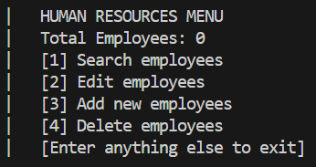
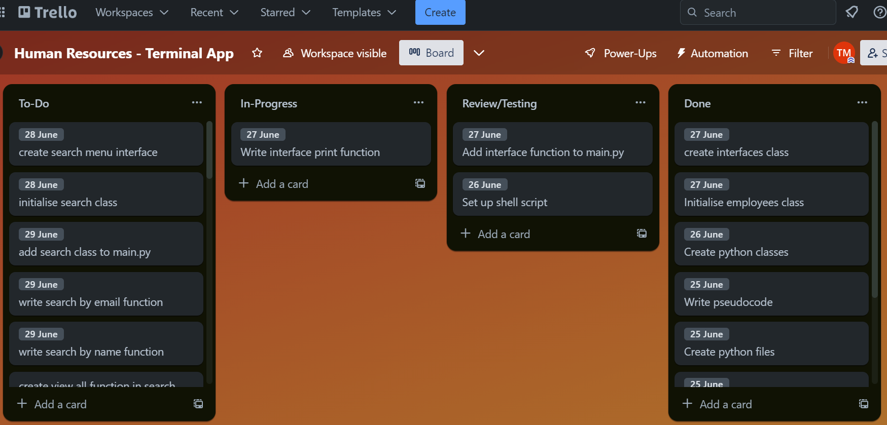
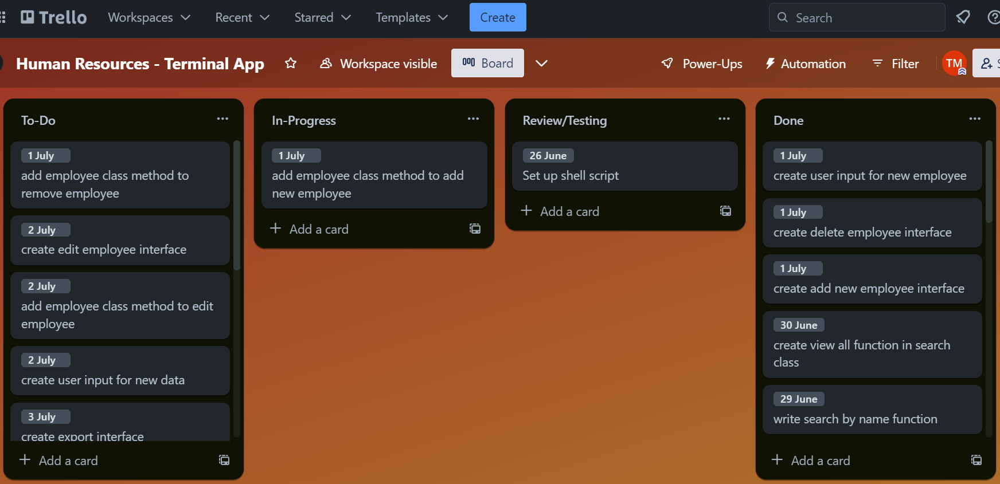

# Human Resources: Terminal Application
### Presentation Video: [youtube.com](https://github.com/TMarentes/terminal-app) 
### GitHub Repository: [github.com](https://github.com/TMarentes/terminal-app) 
 

## Contents
[Styling Convention](https://github.com/TMarentes/terminal-app#styling-convention)

[Application Features](https://github.com/TMarentes/terminal-app#features)

[Help Documentation](https://github.com/TMarentes/terminal-app#help-documentation)

[Implementation Plan](https://github.com/TMarentes/terminal-app#impmlementation-plan)

 

## Styling Convention
The [PEP8](https://peps.python.org/pep-0008/) styling convention was referenced in the development of this application. 

<b>Snake Case: </b>The snake_case naming convention was adopted for this application. This kept the code clean and easy to read.

<b>Code Layout: </b>The code adheres to the code layout guidelines in the PEP8 styling convention. Blank lines are used to indicate logical sections within functions and classes. The recommended max line length of 79 was used throughout the project to ensure readability.

 

## Features
### Search by name or email
This feature allows users of the application to search for employees in the human resources application. Users can search by name, where the name must be an exact match, or users can search by email. The application uses a for loop to find matching employees.

 

### View all employees
Users have the option to view all of the employees within the Employee class. Employees are listed as one per line, with commas separating each attribute.

 

### Export employees to csv
This feature allows users of the application to export employees into a csv file. This is done using the csv python module and file handling. Users are prompted after searching for employees to ask whether they would like to export their search as a csv.

 

### Add & delete employees
Adding and deleting employees is vital in a human resources management system. Users are able to add new employees to the database, as well as delete existing employees by name or email.

 

### Edit existing employee
Users are able to edit existing employees within the database. Users can search by name or email to find the employee they wish to edit.

 

## Help Documentation

### Dependencies

<b>Python3: </b> [Python.org](https://www.python.org/downloads/)

<b>Bash: </b> [Windows](https://hackernoon.com/how-to-install-bash-on-windows-10-lqb73yj3)  / [Mac](https://scriptingosx.com/2019/02/install-bash-5-on-macos/)

<b>Pip: </b> [pypi.org/pip](https://pypi.org/project/pip/)

<b>Requests: </b> [pypi.org/requests](https://pypi.org/project/requests/)

<b>Pytest: </b>  [pytest.org](https://docs.pytest.org/en/7.3.x/)

 

### System Requirements
This application runs on <b>Windows, Mac or Linux</b>.

 

### Installation
1. Download the contents of the "src" folder in the GitHub repository.

2. Navigate to the "src" folder in the terminal. Enter "chmod +x ./script.sh" into the terminal.

3. Execute the "run.sh" file to run the application.

4. Users without the required dependencies will be prompted to install them.

 

### Commands

Upon running the application, users are first greeted with a welcome screen. Users can enter anything to continue, or can simply press enter.

 

<b>Main Menu Interface</b>

The main menu interface presents 5 options to the user. 

- Entering "1" will open the search interface.
- Entering "2" will open the edit interface.
- Entering "3" will prompt users to add a new employee.
- Entering "4" will prompt users to delete an employee.
- Entering anything else will exit the application.

 

<b>Search Interface</b>

The search interface presents 5 options to the user. 

- Entering "1" allows users to search for employees by name. This can be a partial-match to the name.
- Entering "2" allows users to search for employees by email. This must be an exact match of the email.
- Entering "3" lists all of the employees within the database.
- Entering "4" will take users back to the main menu interface.
- Entering anything else will exit the application

After searching or listing all of the employees, the user is asked whether they would like to export the employees as a csv. Typing "Yes" will create a csv file named "export.csv". If the file already exists, it will be overwritten.

 

<b>Edit Interface</b>

The edit interface presents 4 options to the user. 

- Entering "1" allows users to find employees by name, then edit their attributes.
- Entering "2" allows users to find employees by email, then edit their attributes.
- Entering "3" will take users back to the main menu interface.
- Entering anything else will exit the application

 

<b>Add Employee Interface</b>

The add employee interface takes 4 inputs from the user. 

- The first prompt asks for the name of the employee.
- The second prompt asks for the email of the employee.
- The third prompt asks for the department of the employee.
- The fourth prompt asks for the salary of the employee.

 

<b>Delete Employee Interface</b>

The delete employee interface presents 4 options to the user. 

- Entering "1" allows users to find employees by name, then delete them.
- Entering "2" allows users to find employees by email, then delete them.
- Entering "3" will take users back to the main menu interface.
- Entering anything else will exit the application

  

## Implementation Plan
### Initial Steps
In the early stages of developing a terminal application in Python, the first steps are creating a GitHub repository and establishing a connection to Git. This enables version control as the project progresses.

|Task|Deadline|Status|
|----------------|:------:|:----:|
|Create github repository|  24/06/23      |  ✅  | 
|Connect git|  24/06/23      |  ✅  | 
|Create assignment directories|  25/06/23      |  ✅  | 
|Write Pseudocode|  25/06/23      |  ✅  | 
|Create python files|  25/06/23      |  ✅  | 
|Setup shell script|  26/06/23      |  ✅  | 
|Create python classes| 26/06/23       |  ✅  | 

 

### Interface
An interface will be created with an interface class with multi-line print statements as functions.

|Task|Deadline|Status|
|----------------|:------:|:----:|
|create interfaces class|  27/06/23      |  ✅  | 
|write interface print function|  27/06/23      |   ✅ | 
|add interface function to main.py|  28/06/23      |  ✅  | 
|initialise employees class|  28/06/23      |  ✅  | 

 

### Search by name or email
The search functionality will use a Search class with functions that access the Employee class.

|Task|Deadline|Status|
|----------------|:------:|:----:|
|create search menu interface|  28/06/23      |  ✅  | 
|initialise search class|  28/06/23      |  ✅  | 
|write search by name function|  29/06/23      |  ✅  | 
|write search by email function|  29/06/23      |  ✅  | 
|add search class to main.py|  29/06/23      |  ✅  | 
|run pytests on search functions|  05/07/23      | ✅   | 

 

### View all employees
To view all employees, a method in the Search class accesses the entire Employee class.

|Task|Deadline|Status|
|----------------|:------:|:----:|
|create view all function in search class|  30/06/23      |  ✅  | 
|run pytests on view all function| 05/07/23     |  ✅  | 

 

### Add & delete employees
To add and delete employees, methods are used in the Employee class.

|Task|Deadline|Status|
|----------------|:------:|:----:|
|create add new employee interface|  01/07/23      |  ✅  | 
|create delete employee interface| 01/07/23     |  ✅  | 
|create user input for new employee|  01/07/23      |  ✅  | 
|add employee class method to add new employee|  01/07/23      |  ✅  | 
|add employee class method to remove employee|  01/07/23      |  ✅  | 

 

### Edit existing employee
To edit an existing employee, the user first must search for the employee, then will be prompted with inputs for the new information.

|Task|Deadline|Status|
|----------------|:------:|:----:|
|create edit employee interface|  02/07/23      |  ✅  | 
|create user input for new data| 02/07/23     |  ✅  | 
|add employee class method to edit employee|  02/07/23      |  ✅  | 

 

### Export employees to csv
Employees are exported using the csv module in python.

|Task|Deadline|Status|
|----------------|:------:|:----:|
|create export interface|  03/07/23      |  ✅  | 
|initialise export class| 03/07/23     |  ✅  | 
|write export all to csv function|  03/07/23      |  ✅  | 
|write export by name|  03/07/23      |  ✅  | 
|write export by email|  03/07/23      |  ✅  | 

